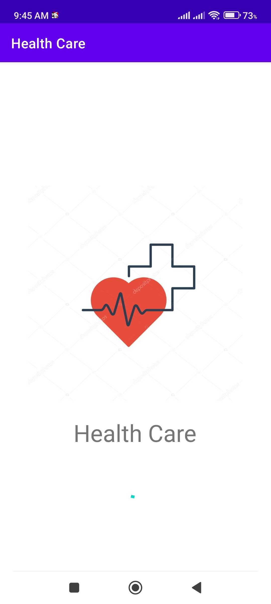
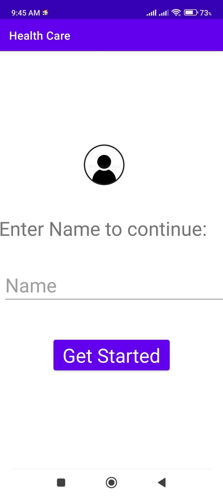

# Health Care
* Health App

## Description
* This is an Android Application that allows a user to search for their possible ailments according to symptoms searched for.

#### Author: **EDWIN MURIITHI**

## Getting Started
### Dependancies
* Android Studio

### Project Setup Instructions

* Fork this repo
* Clone this repo
* Setup necessary database.
* Open  the project in your desired editor (Android Studio)
* Build and clean the project
* Run the app

## Development.
### Technologies Used
* Java
* Gradle
* ViewBinding
* Junit

## Want to contribute? Great!

### To fix a bug or enhance an existing module, follow these steps:

* Fork the repo
* Create a new branch (`git checkout -b improve-feature`)
* Make the appropriate changes in the files
* Add changes to reflect the changes made
* Commit your changes (`git commit -m 'Improve feature'`)
* Push to the branch (`git push origin improve-feature`)
* Create a Pull Request

## APK Location
* IP1 -https://ufile.io/l2ukp8tz
* IP2 -https://ufile.io/p0zlm24x

## Contact Information
[Edwin Muriithi](https://github.com/edwinmuriithi)

